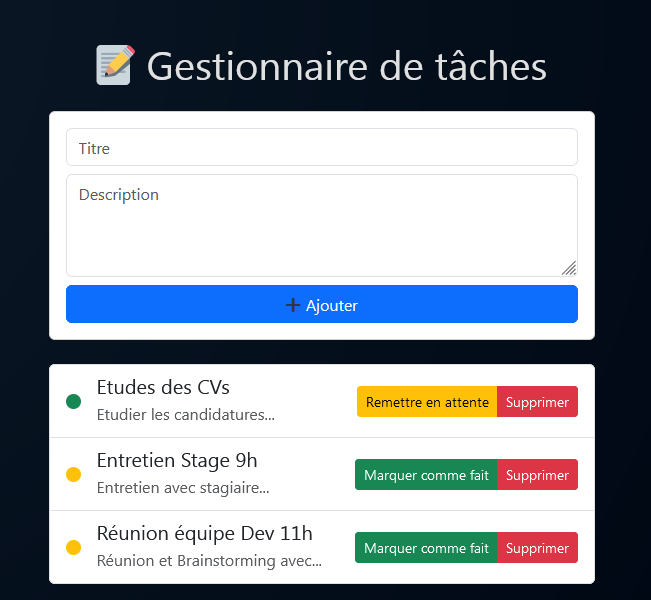

# Gestionnaire de Tâches 


## Application fullstack en TypeScript

Ce projet est une application web simple de gestion de tâches, destinée à une équipe interne. 
Elle est composée de deux parties :  

- **Frontend** : une interface utilisateur avec React qui permet d’ajouter, modifier, supprimer et marquer des tâches comme faites.  
- **Backend** : une API REST en Node.js/Express qui gère les données des tâches.

---
 ## Prérequis :
Node.js 18 ou plus.
Téléchargement : https://nodejs.org/fr/download
- Vérifier l’installation :
```bash
node -v
npm -v
```

## 🚀 Installation & Lancement

### 1. Télécharger le projet
#### Option 1 :
Cloner avec Git:
```bash
git clone https://github.com/salim4dev/Task-Manager.git
```
#### Option 2 :
Télécharger le .zip puis extraire le dossier.


### 2. Lancer le backend
```bash
cd backend
npm install
npm run dev
```
✅ Le serveur écoute par défaut sur http://localhost:4000

### 3. Lancer le frontend
Ouvrir un autre terminal:
```bash
cd frontend
npm install
npm run dev
```
✅ L’application est accessible sur http://localhost:5173/

---
## Fonctionnalités

➕ Ajouter une tâche avec titre et description

📜 Voir la liste des tâches

✅ Marquer une tâche comme faite ou 🕒 remise en attente

X  Supprimer une tâche

## Aperçu


---

##  Stack technique utilisée

### **Frontend**
- ⚛️ [React](https://react.dev/) avec **TypeScript**
- 🎨 [Bootstrap 5](https://getbootstrap.com/) pour le style
- 📦 [Vite](https://vitejs.dev/) comme outil de build

### **Backend**
-  [Node.js](https://nodejs.org/) + [Express](https://expressjs.com/)
-  **Base de données en mémoire** (simulation JSON pour le stockage)
- 🔌 API RESTful avec routes CRUD

### **Outils & Développement**
- 📡 [Axios](https://axios-http.com/) pour les requêtes HTTP
-   [Nodemon](https://nodemon.io/) pour le rechargement automatique du backend
-   TypeScript pour typage strict et meilleure maintenabilité


